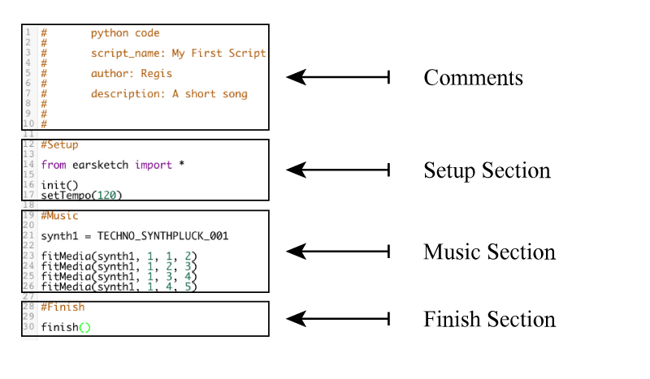

# Entry 2: Deciding on EarSketch
I have finially decided to use my independent study time for EarSketch. After spending all weekend diving deep into Gosu I find out that I do not really like
how the program works. The way I have to set it up and how I can't really work on it in shcool and then transfer it back at home. Since I use a window at 
home and the school's computers are Macs, I have to change how I run the program everytime I take it back home. The process becomes very annoying to do 
every time I take the project I worked on in class back at home.
___
## EarSketch Tutorials
Frist step I did to start learning EarSketch is to start with the lessons EarSketch had build in on the side of their program. So far I have got to 
Chater 1 unit 5 lesson 1. They start with the basic syntax to just get one sound running.
  
There are many things you need befor you can start your project. Here is a list of them you *Must* have before starting.
* ``from earsketch import *``
* ``init()``
* ``setTempo(number here to set how fast music goes)`` Number can range from 45-220.
* ``finish()``
Make sure you have these 4 things before you start putting music in.
___
Any music input must have ``fitMedia(clipName, trackNumber, startMeasure, endMeasure)``
___
## Adding effects to clip of music
___
## Takeaways
1. When you are following someone's documentation it might not always work with your own setup. When that comes just use google and try to find a way around the problem.
2. Stuck on two topics? Pick one to start with and go really deep with it to see if you like it or not. If not **switch**.
3. The first solution you found might not be the one that works for you. Keep looking and be specific when it comes to your google searches.