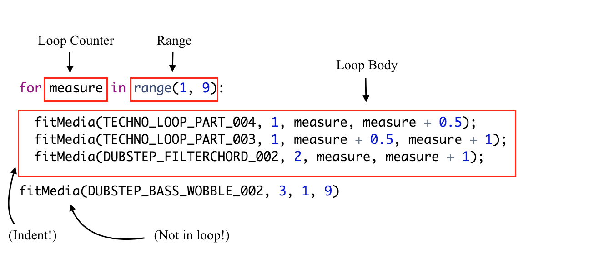

# Entry 3: Week 3 of learning EarSketch Tutorials
This week I learned a lot of new things I can do with EarSketch. I learned things like tempo and pitch to a sound. How to use transitions in music so I can get a 
separation from one clip of music to the next. I also learned that there is looping with EarSketch so the user can make their music a lot more efficient and the code
does not have to be very long. From that there was the introduction of custom functions which is like what we did in ruby with ``def``. However, there is no ``end`` 
to the functions. You can just move on to the next step which is calling your functions. Lastly, this week I learned about ``makeBeat()`` which is a function that makes
beats of your song which is very similar to ``fitMedia()``. However, ``makeBeat()`` is like one note in a clip of music while ``fitMedia()`` plays a clip of music
which is a lot longer than just a single note.
___
# Notes
## Tempo
``setTempo(bpm)`` 
**bpm** = beats per minutes 

General bom for each genre of music.
- Hip Hop: 85-95 bpm
- Pop: 118 bpm
- Techno: 120-125 bpm
- Electro: 128 bpm
- House: 115-130 bpm
- Dubstep and Trap: 140 bpm
- Drum & Bass: 160 - 180 bpm

## Transitions
- *Crash Cymbal*: Placing a crash cymbal on beat 1 of a new section is a simple way to signal a change.

- *Drum Fill*: A rhythmic variation used to fill the gap before a new section of music.

- *Track Dropouts*: Specify certain tracks to temporarily drop out during a transition to create rests or pauses. The ear is accustomed to repetition, so this grabs the listener’s attention.

- *Melody Variation*: Introduce a variation of the chords, bassline, or melody before the new section. Often, a folder within the EarSketch sounds library contains variations of a similar riff. For example, take a look at the sounds under the UK_HOUSE_ARPLEAD folder.

- *Riser*: A sustained note or noise that increases in pitch

## Custom functions

``def functionName(parameter one, parameter two):``
There is no need for ``end``. Remember the **colon** at the end.

## Loops
  
- **Loop Body**: The body of a loop contains statements that will execute repeatedly. It includes everything that is indented (using the tab key) directly after the colon :
- **Loop Counter**: Creates a variable to be used as a loop counter.
- **Range**: A function that makes a list of numbers for the loop counter to count through. The keyword in checks if the loop counter value is in the specified range. range() takes two arguments, a starting point (inclusive) and ending point (exclusive): range(startingNumber, endingNumber).

## Beats

``makeBeat()`` takes four arguments:

- Clip Name
- Track Number
- Measure Number: makeBeat() only requires a starting measure; the string length determines the end measure.
- Beat String

## Making beats with strings

It takes 16-character beat string to make a measure. But it does not have to be 16 beats long.

Example:
``myDrumBeat = "0-00-00-0++0+0"``

- "0" starts playing a clip.

- "-" is a rest, meaning silence.

+ "+" extends the audio clip into the next sixteenth note sub-beat. It always follows a 0 or +.

You can also use concatenation to make a longer beat. 
*concatenation* is using multiple short beats to  make a longer more complex beats.

Example:
beat1 = "0+++"
beat2 = "0+0-"

beat3 = beat1 + beat2
beat3 = "0+++0+0-"
---

## takeaways
1. When coming across something you do not understand, even after you have read the documentation. It is a good idea to find a video of someone explaining it. Sometimes
the visuals in the video can help you understand the topic.
2. Take notes while learning something is very useful. When I was coding in EarSketch I often look back at my old entries to see the syntax and what parameter the function
takes in.
